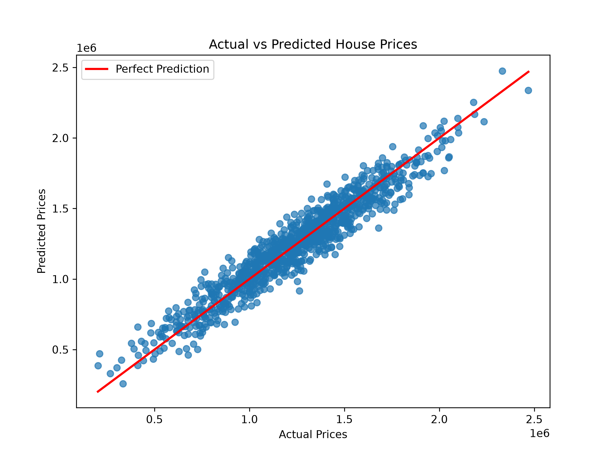

# 🏠 House Price Prediction using Machine Learning

Predict house prices using **Linear Regression** with the USA Housing dataset.


---

## 📌 Overview

This project uses **Linear Regression** to predict house prices based on various housing features such as:

- Average Area Income
- Average Area House Age
- Average Number of Rooms
- Average Number of Bedrooms
- Area Population

The model is trained using the **USA Housing Dataset** and achieves an **R² Score of approximately 0.918**, indicating excellent prediction performance.

---

## 🚀 Features

- 📂 Load housing dataset
- 🧹 Handle missing values
- 📊 Data exploration
- 🤖 Train Linear Regression model
- 🏠 Predict house prices
- 📈 Evaluate model using R² Score & MAE
- 💾 Save trained model using Joblib
- 📉 Visualize Actual vs Predicted Prices

---

## 🛠️ Tech Stack

- Python
- Pandas
- NumPy
- Matplotlib
- Scikit-learn
- Joblib

---

## 📁 Project Structure

```text
House-Price-Prediction/
│
├── dataset/
│   └── house_prices.csv
├── images/
│   └── prediction_plot.png
├── model/
│   └── house_price_model.pkl
├── house_price_prediction.py
├── requirements.txt
├── README.md
└── .gitignore
```

---

## 📊 Model Performance

| Metric | Value |
|--------|--------|
| Algorithm | Linear Regression |
| R² Score | **0.918** |
| Mean Absolute Error | **80,879** |

---

## 📈 Actual vs Predicted House Prices

The scatter plot below compares the model's predictions with the actual house prices. The red line represents the ideal prediction (`y = x`).



---

## ▶️ Installation

```bash
git clone https://github.com/YOUR_USERNAME/House-Price-Prediction.git

cd House-Price-Prediction

pip install -r requirements.txt

python house_price_prediction.py
```

---

## 📌 Sample Output

```text
Training data shape: (4000, 5)
Testing data shape: (1000, 5)

Model trained successfully!

R² Score: 0.918

Mean Absolute Error: 80879.09

Predicted House Price: $1224243.16

Model saved successfully!
```

---

## 🔮 Future Improvements

- Build a Streamlit web application
- Compare multiple regression algorithms
- Hyperparameter tuning
- Deploy the model online
- Add interactive data visualizations

---

## 👨‍💻 Author

**Saisha Roham**

If you found this project helpful, don't forget to ⭐ the repository!